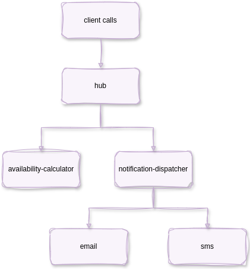

- [business platform demo](#business-platform-demo)
  - [architecture diagram](#architecture-diagram)
  - [build services and run using docker](#build-services-and-run-using-docker)
    - [build docker locally](#build-docker-locally)
    - [run local container in background with otel](#run-local-container-in-background-with-otel)
    - [run k6 test](#run-k6-test)
    - [stop everything](#stop-everything)
    - [build and run local with otel for testing](#build-and-run-local-with-otel-for-testing)
  - [build and push to dockerhub in multi arch](#build-and-push-to-dockerhub-in-multi-arch)
  - [remove all images](#remove-all-images)
  - [k8s deployment](#k8s-deployment)
  - [generate k8s deployment yaml](#generate-k8s-deployment-yaml)

# business platform demo

This is a guide to deploy a set of synchronous and asynchronous microservices in spring boot to observed with & Grafana LGTM OSS stack or Grafana Cloud.

## architecture diagram



## build services and run using docker

### build docker locally
```bash
mvn install
mvn clean package exec:exec@rmi exec:exec@build -f hub/pom.xml
mvn clean package exec:exec@rmi exec:exec@build -f availability-calculator/pom.xml
mvn clean package exec:exec@rmi exec:exec@build -f notification-dispatcher/pom.xml
mvn clean package exec:exec@rmi exec:exec@build -f sms/pom.xml
mvn clean package exec:exec@rmi exec:exec@build -f email/pom.xml
```

### run local container in background with otel
```bash
mvn exec:exec@runoteld -f hub/pom.xml
mvn exec:exec@runoteld -f availability-calculator/pom.xml
mvn exec:exec@runoteld -f notification-dispatcher/pom.xml
mvn exec:exec@runoteld -f sms/pom.xml
mvn exec:exec@runoteld -f email/pom.xml
```

### run k6 test
```bash
docker run -d --rm \
  --name k6 \
  --network primenet \
  -v $(pwd)/k6/script.js:/config/script.js:ro \
  -v $(pwd)/k6/loop.sh:/home/k6/loop.sh:ro \
  --entrypoint /bin/sh \
  grafana/k6:1.0.0-with-browser \
  /home/k6/loop.sh
```

### stop everything
```bash
docker stop hub availability-calculator notification-dispatcher sms email k6
```

### build and run local with otel for testing
```bash
mvn install
mvn clean package exec:exec@rmi exec:exec@build exec:exec@runotel -f hub/pom.xml
mvn clean package exec:exec@rmi exec:exec@build exec:exec@runotel -f availability-calculator/pom.xml
mvn clean package exec:exec@rmi exec:exec@build exec:exec@runotel -f notification-dispatcher/pom.xml
mvn clean package exec:exec@rmi exec:exec@build exec:exec@runotel -f sms/pom.xml
mvn clean package exec:exec@rmi exec:exec@build exec:exec@runotel -f email/pom.xml
```

## build and push to dockerhub in multi arch

```bash
mvn install
mvn clean package exec:exec@buildpush -f hub/pom.xml
mvn clean package exec:exec@buildpush -f availability-calculator/pom.xml
mvn clean package exec:exec@buildpush -f notification-dispatcher/pom.xml
mvn clean package exec:exec@buildpush -f sms/pom.xml
mvn clean package exec:exec@buildpush -f email/pom.xml
```

## remove all images

```bash
mvn clean exec:exec@rmi -f hub/pom.xml
mvn clean exec:exec@rmi -f availability-calculator/pom.xml
mvn clean exec:exec@rmi -f notification-dispatcher/pom.xml
mvn clean exec:exec@rmi -f sms/pom.xml
mvn clean exec:exec@rmi -f email/pom.xml
```

## k8s deployment

```bash
kubectl apply -f https://raw.githubusercontent.com/alainpham/business-platform/refs/heads/master/k8s-deployment/hub-deploy.yaml
kubectl apply -f https://raw.githubusercontent.com/alainpham/business-platform/refs/heads/master/k8s-deployment/availability-calculator-deploy.yaml
kubectl apply -f https://raw.githubusercontent.com/alainpham/business-platform/refs/heads/master/k8s-deployment/notification-dispatcher-deploy.yaml
kubectl apply -f https://raw.githubusercontent.com/alainpham/business-platform/refs/heads/master/k8s-deployment/sms-deploy.yaml
kubectl apply -f https://raw.githubusercontent.com/alainpham/business-platform/refs/heads/master/k8s-deployment/email-deploy.yaml

kubectl apply -f https://raw.githubusercontent.com/alainpham/business-platform/refs/heads/master/k8s-deployment/k6.yaml


kubectl delete -f https://raw.githubusercontent.com/alainpham/business-platform/refs/heads/master/k8s-deployment/hub-deploy.yaml
kubectl delete -f https://raw.githubusercontent.com/alainpham/business-platform/refs/heads/master/k8s-deployment/availability-calculator-deploy.yaml
kubectl delete -f https://raw.githubusercontent.com/alainpham/business-platform/refs/heads/master/k8s-deployment/notification-dispatcher-deploy.yaml
kubectl delete -f https://raw.githubusercontent.com/alainpham/business-platform/refs/heads/master/k8s-deployment/sms-deploy.yaml
kubectl delete -f https://raw.githubusercontent.com/alainpham/business-platform/refs/heads/master/k8s-deployment/email-deploy.yaml

kubectl delete -f https://raw.githubusercontent.com/alainpham/business-platform/refs/heads/master/k8s-deployment/k6.yaml
```

## generate k8s deployment yaml

```bash
mvn exec:exec@kyml -f hub/pom.xml
mvn exec:exec@kyml -f availability-calculator/pom.xml
mvn exec:exec@kyml -f notification-dispatcher/pom.xml
mvn exec:exec@kyml -f sms/pom.xml
mvn exec:exec@kyml -f email/pom.xml

cp **/target/*-deploy.yaml ./k8s-deployment
```
